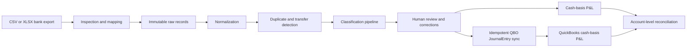

# Finz Accounting Pipeline

An end-to-end accounting-data application for importing bank exports,
preserving source evidence, normalizing transactions, detecting duplicates and
internal transfers, classifying accounting activity, generating cash-basis
Profit and Loss reports, synchronizing approved entries to QuickBooks Online,
and reconciling the internal ledger against QuickBooks.

Built for the Finz Data Engineering Internship technical challenge using
Python, FastAPI, MongoDB, Gemini, and the QuickBooks Online API.

## Validated results

| Validation | Result |
| --- | ---: |
| Physical source rows | 200 |
| Canonical transactions | 195 |
| Exact duplicate rows | 5 |
| Chart-of-accounts entries | 21 |
| P&L transactions | 180 |
| Balance-sheet transactions | 15 |
| Planned QuickBooks JournalEntries | 189 |
| Successful QBO sync records | 189 |
| Controlled QBO P&L accounts reconciled | 17 |
| Monthly and consolidated periods reconciled | 4 |
| Automated tests | 408 passing |

A repeated live synchronization created **0 new JournalEntries** and reused all
**189** previously successful records.

The live QuickBooks reconciliation matched every controlled account, subtotal,
and net-profit value at an exact **$0.00 difference**.

## Financial results

| Cash-basis period | Revenue | COGS | Gross profit | Operating expenses | Net profit |
| --- | ---: | ---: | ---: | ---: | ---: |
| April 2026 | $98,175.00 | $31,325.00 | $66,850.00 | $44,860.00 | $21,990.00 |
| May 2026 | $106,575.00 | $32,050.00 | $74,525.00 | $46,240.00 | $28,285.00 |
| June 2026 | $95,525.00 | $30,475.00 | $65,050.00 | $47,145.00 | $17,905.00 |
| Consolidated | **$300,275.00** | **$93,850.00** | **$206,425.00** | **$138,245.00** | **$68,180.00** |

## Completed workflow

1. Inspect CSV and Excel bank exports before persistence.
2. Apply configurable worksheet, header, date, currency, bank-account, and
   column mappings.
3. Preserve immutable raw records and create canonical normalized
   transactions.
4. Detect exact duplicates and paired internal transfers.
5. Classify transactions through learned patterns, deterministic accounting
   rules, and Gemini fallback.
6. Review, correct, approve, or reject classifications.
7. Generate monthly and consolidated cash-basis Profit and Loss reports.
8. Connect securely to a QuickBooks Online sandbox.
9. Synchronize approved transactions as balanced, idempotent JournalEntries.
10. Pull QuickBooks cash-basis reports and reconcile every controlled account
    and total.

## User interface

The server-rendered interface provides seven accounting workflows:

- Overview and pipeline evidence
- Upload and configurable source mapping
- Normalized transaction ledger
- Classification review and correction
- Monthly and consolidated Profit and Loss reporting
- QuickBooks connection and guarded synchronization
- Live QuickBooks reconciliation

The interface uses FastAPI, Jinja2, browser-native JavaScript, and responsive
CSS. It calls the same repositories and accounting services as the JSON API.

## Architecture



Classification precedence:

```text
learned approved pattern
    -> deterministic accounting rule
    -> Gemini structured-output fallback
    -> manual review when no safe decision is available
```

## Technology

- Python 3.12
- FastAPI and Uvicorn
- MongoDB 8 with asynchronous PyMongo
- Pydantic and Pydantic Settings
- Google Gemini structured-output API
- QuickBooks Online OAuth 2.0 and accounting APIs
- Jinja2, JavaScript, and CSS
- Docker Compose
- Pytest and Ruff

## Local setup

### 1. Create the environment

```bash
python -m venv .venv
source .venv/bin/activate
python -m pip install --upgrade pip
python -m pip install -e ".[dev]"
```

### 2. Configure local settings

```bash
cp .env.example .env
chmod 600 .env
```

Add credentials only to the ignored local `.env`.

Never commit:

- Gemini API keys
- QuickBooks client secrets
- OAuth codes or state values
- Realm IDs
- Access or refresh tokens
- Encryption keys
- Session secrets
- Financial workbooks

### 3. Start MongoDB

```bash
docker compose up -d mongodb
docker compose ps
```

The named Docker volume preserves MongoDB data between restarts.

### 4. Start the application

```bash
python -m uvicorn app.main:app \
  --host 127.0.0.1 \
  --port 8000 \
  --reload
```

Open:

```text
http://127.0.0.1:8000
```

Health endpoints:

```text
http://127.0.0.1:8000/api/v1/health/live
http://127.0.0.1:8000/api/v1/health/ready
```

Interactive API documentation:

```text
http://127.0.0.1:8000/docs
```

## Gemini classification

Gemini is used only after learned patterns and deterministic rules cannot
produce a safe result.

Requests contain controlled transaction evidence and the allowed chart of
accounts. Responses are constrained by JSON Schema and validated again through
Pydantic and accounting-safety checks.

Run the live nonpersistent demonstration:

```bash
python scripts/demo_gemini_classification.py
```

Validated result:

```text
Synthetic description: NORTHSTAR ADVISORY SERVICES INV 8842
Transaction type: operating_expense
QBO account: 6070 Professional Fees
Persisted classification: False
QuickBooks write performed: False
Gemini API key displayed: False
```

## QuickBooks synchronization

The synchronization service:

- Uses encrypted OAuth tokens stored in MongoDB
- Refreshes tokens safely when required
- Reuses the controlled chart of accounts
- Creates balanced JournalEntries
- Combines paired internal-transfer rows into one accounting entry
- Uses deterministic request identifiers
- Persists synchronization state
- Recovers stale attempts safely
- Avoids displaying external transaction identifiers

Run the guarded sandbox synchronization:

```bash
python scripts/sync_qbo_sandbox.py \
  --confirm BRIGHTFIX-SANDBOX-LIVE-SYNC
```

Validated repeated-run result:

```text
Planned JournalEntries: 189
Newly succeeded: 0
Previously succeeded and reused: 189
Retry attempts: 0
Persisted succeeded records: 189
```

## QuickBooks reconciliation

The reconciliation is read-only:

```bash
python scripts/reconcile_qbo_profit_and_loss.py
```

It retrieves cash-basis reports for April, May, June, and the consolidated
quarter.

The comparison is scoped to the 17 controlled BrightFix P&L accounts so
unrelated Intuit sandbox sample activity does not affect the result.

Validated result:

```text
Periods compared: 4
Every controlled account difference: $0.00
Every total difference: $0.00
QuickBooks cash-basis P&L reconciliation: PASS
```

## Accounting treatment

### Receipts

```text
Debit  bank account
Credit revenue or equity account
```

### Payments

```text
Debit  expense, COGS, asset, or equity account
Credit bank account
```

### Customer refunds

```text
Debit  contra-revenue
Credit bank account
```

### Internal transfers

The two source rows are paired into one JournalEntry:

```text
Debit  destination bank account
Credit source bank account
```

Transfers therefore move cash between balance-sheet accounts without creating
false revenue or expense.

## Security and accounting controls

- `.env`, logs, uploads, credentials, tokens, and workbooks are ignored.
- OAuth access and refresh tokens are encrypted before persistence.
- OAuth state is registered, signed, time-limited, and single-use.
- Decimal accounting amounts are preserved without binary floating-point math.
- Raw records remain separate from normalized records.
- Duplicate rows do not enter reporting or synchronization.
- Only approved classifications are eligible for synchronization.
- QuickBooks writes are guarded and idempotent.
- Reconciliation compares exact account and total values.
- Provider errors are surfaced without exposing secrets.

## Validation

```bash
python -m ruff check app tests scripts
python -m pytest
git diff --check
```

Current result:

```text
408 passed
```

## Architecture documentation

Detailed system boundaries, persistence design, classification precedence,
accounting treatment, synchronization state, security controls, and
reconciliation logic are documented in
[`docs/ARCHITECTURE.md`](docs/ARCHITECTURE.md).

## Project status

The complete required workflow has been implemented and validated locally
against MongoDB, Gemini, and a QuickBooks Online sandbox.

The repository contains the production implementation, automated tests, safe
configuration template, setup instructions, validated accounting results, and
technical architecture documentation.
