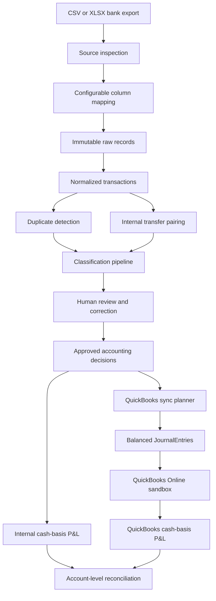
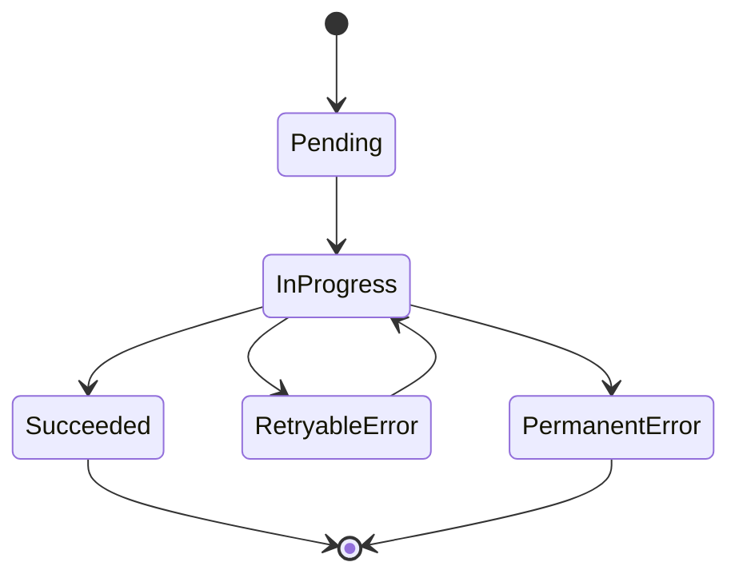

# Architecture and Accounting Design

## Purpose

Finz Accounting Pipeline converts untrusted bank-export data into reviewed
accounting records, cash-basis financial reports, QuickBooks Online
JournalEntries, and exact reconciliation evidence.

The design prioritizes:

- Source-data preservation
- Accounting correctness
- Auditability
- Human review
- Idempotent external synchronization
- Secret-safe provider integration
- Exact reconciliation

## System flow



FastAPI JSON routes and the server-rendered interface use the same repositories
and domain services. Accounting rules are not duplicated in browser
JavaScript.

## Application layers

### Presentation

The application exposes:

- FastAPI JSON endpoints
- Jinja2-rendered accounting workflow pages
- Browser-native JavaScript for API interaction
- Responsive CSS
- OpenAPI documentation

The interface supports:

- Upload and mapping
- Transaction inspection
- Classification review and correction
- Monthly and consolidated P&L reporting
- QuickBooks synchronization
- QuickBooks reconciliation

### Domain services

Domain services implement:

- Source inspection
- Normalization
- Duplicate detection
- Transfer detection
- Classification
- Review and correction
- Profit and Loss generation
- QuickBooks planning and synchronization
- QuickBooks report parsing
- Reconciliation

### Repositories

MongoDB repositories isolate persistence for:

- Upload batches
- Raw records
- Normalized transactions
- Classifications
- Learned classification patterns
- QuickBooks OAuth state
- QuickBooks encrypted connections
- QuickBooks synchronization records
- Profit and Loss reporting sources

## Source ingestion

### Inspection before persistence

CSV and XLSX files are treated as untrusted input.

Inspection verifies:

- File extension and type
- Maximum file size
- Workbook readability
- Worksheet names
- Header candidates
- Available columns

The inspection endpoint does not persist the file.

### Configurable mapping

An ingestion configuration defines:

- File type
- Worksheet name
- Header row
- Date format
- Source-column mappings
- Default currency
- Default bank account

This prevents the pipeline from depending on one hard-coded bank-export layout.

### Raw evidence

Every physical source row is preserved separately from normalized records.

Raw records retain source lineage so later normalization, classification, and
review activity does not overwrite the original evidence.

## Normalized transaction model

Canonical normalized transactions contain validated values such as:

- Source transaction identity
- Transaction date
- Posted date
- Original description
- Normalized description
- Decimal amount
- Currency
- Bank account
- Cash direction
- Validation status
- Duplicate reference
- Upload and raw-record lineage

Accounting amounts use decimal values rather than binary floating-point
arithmetic.

## Duplicate handling

The supplied workbook contains:

```text
200 physical rows
195 canonical transactions
5 exact duplicate rows
```

Exact duplicates remain preserved as evidence but are excluded from:

- Classification outputs
- Profit and Loss reporting
- QuickBooks synchronization

This prevents duplicate source activity from becoming duplicate accounting
entries.

## Internal transfer detection

Transfers appear as two bank rows:

- Cash leaving one controlled bank account
- Cash entering another controlled bank account

The two source rows are paired and represented as one accounting entry:

```text
Debit  destination bank account
Credit source bank account
```

Transfers affect balance-sheet accounts only. They do not create revenue,
expense, gain, or loss.

For the BrightFix dataset:

```text
12 source transfer rows
6 paired transfer JournalEntries
```

## Classification architecture

Classification precedence is deterministic-first:

```text
approved learned pattern
    -> deterministic accounting rule
    -> Gemini structured-output fallback
    -> manual handling when no safe decision is available
```

### Learned patterns

An approved manual correction can become a reusable classification pattern.

Pattern reuse is based on controlled evidence and an approved source
classification. A learned pattern cannot be created from an unsafe or
unapproved classification.

### Deterministic rules

Rules classify known accounting descriptions such as:

- Customer receipts
- Payroll
- Rent
- Bank fees
- Subcontractors
- Materials
- Owner distributions
- Transfers
- Customer refunds

Deterministic rules are preferred because they are reproducible, explainable,
and inexpensive.

### Gemini fallback

Gemini is called only when earlier classification paths do not produce a safe
decision.

The request includes controlled evidence:

- Transaction date
- Original and normalized description
- Amount
- Direction
- Bank account
- Allowed transaction types
- Allowed chart-of-accounts choices

Gemini must return structured JSON containing:

- Transaction type
- QuickBooks account number
- Counterparty
- Confidence
- Explanation

The response is constrained using JSON Schema and then validated again through:

- Pydantic
- Allowed transaction types
- Controlled chart-of-accounts membership
- Account activity status
- Cash-direction compatibility
- Accounting-safety rules

Provider output is never trusted directly.

### Human review

Review operations are version-aware.

A reviewer can:

- Approve a pending classification
- Reject a pending classification
- Append a validated manual correction

Corrections preserve an audit trail instead of silently replacing earlier
classification evidence.

## Accounting treatment

### Revenue receipts

```text
Debit  bank account
Credit revenue account
```

### Owner contributions

```text
Debit  bank account
Credit owner's equity
```

### Operating expenses

```text
Debit  operating expense
Credit bank account
```

### Cost of Goods Sold

```text
Debit  COGS account
Credit bank account
```

### Fixed-asset purchases

```text
Debit  fixed asset
Credit bank account
```

### Owner distributions

```text
Debit  owner's equity
Credit bank account
```

### Customer refunds

```text
Debit  customer-refund contra-revenue
Credit bank account
```

### Internal transfers

```text
Debit  destination bank account
Credit source bank account
```

Every QuickBooks JournalEntry must remain balanced.

## Profit and Loss reporting

The internal report is cash basis.

Only transactions that are:

- Canonical
- Valid
- Nonduplicate
- Approved
- Assigned to P&L accounts

are included.

The report contains:

- Revenue accounts
- Customer-refund contra-revenue
- Total revenue
- Cost of Goods Sold accounts
- Total COGS
- Gross profit
- Operating expense accounts
- Total operating expenses
- Net profit

Reports are generated for:

- April 2026
- May 2026
- June 2026
- April through June consolidated

Each account retains transaction-level drill-down evidence.

## QuickBooks OAuth security

QuickBooks Online connectivity uses OAuth 2.0.

Security controls include:

- Signed authorization state
- MongoDB registration of expected state
- Expiration validation
- Single-use state consumption
- Encrypted access and refresh tokens
- Revision-aware token rotation
- Secret-safe exception handling

The application does not display:

- Client secrets
- Authorization codes
- State values
- Realm IDs
- Access tokens
- Refresh tokens
- Token encryption keys

## QuickBooks synchronization

The sync planner converts approved accounting decisions into balanced
JournalEntry plans.

For the BrightFix dataset:

```text
195 canonical source transactions
183 single-source JournalEntries
6 paired-transfer JournalEntries covering 12 source rows
189 total planned JournalEntries
```

### Idempotency

Each planned JournalEntry receives a deterministic request identity.

Synchronization state is persisted so repeated runs can distinguish:

- New work
- Already successful work
- Recoverable stale attempts
- Retryable provider failures
- Permanent provider failures

A validated repeated run produced:

```text
Planned JournalEntries: 189
Newly succeeded: 0
Previously succeeded and reused: 189
Retry attempts: 0
Persisted succeeded records: 189
```

No duplicate QuickBooks entries were created.

### Synchronization state model



Successful records retain QuickBooks transaction identifiers in persistence,
but acceptance output and the UI do not display those identifiers.

## QuickBooks reconciliation

Reconciliation is read-only.

The service retrieves QuickBooks cash-basis Profit and Loss reports using:

- Exact reporting dates
- Cash accounting basis
- Controlled BrightFix P&L account IDs

The account filter is important because the Intuit sandbox contains unrelated
sample activity on other accounts.

The reconciliation compares:

- Every controlled revenue account
- Customer refunds
- Every controlled COGS account
- Every controlled operating-expense account
- Total revenue
- Total COGS
- Gross profit
- Total operating expenses
- Net profit

All comparisons use exact decimal amounts.

Validated scope:

```text
Controlled P&L accounts: 17
Periods compared: 4
Every account difference: $0.00
Every total difference: $0.00
```

Validated consolidated result:

```text
Revenue:              $300,275.00
COGS:                  $93,850.00
Gross profit:         $206,425.00
Operating expenses:   $138,245.00
Net profit:            $68,180.00
```

## Failure handling

The application separates failure types:

- Invalid source data
- Invalid mappings
- Duplicate file uploads
- Persistence conflicts
- Stale classification versions
- Unsafe accounting corrections
- MongoDB unavailability
- Gemini provider failures
- QuickBooks OAuth failures
- Retryable QuickBooks API failures
- Permanent QuickBooks API failures
- Reconciliation differences

A failed accounting operation stops the workflow rather than silently
continuing with incomplete or inconsistent results.

## Security boundaries

The repository excludes:

- `.env`
- Logs
- Uploads
- Financial workbooks
- OAuth credentials
- Encryption keys
- Session secrets
- Tokens
- Local databases

The supplied challenge workbook remains external to the repository.

All live provider acceptance was performed using:

- A Gemini API key stored only in ignored local configuration
- A QuickBooks Online sandbox
- Encrypted QuickBooks token persistence
- Secret-safe terminal and UI output

## Validated implementation evidence

```text
Raw source rows: 200
Canonical transactions: 195
Classifications: 195
QuickBooks successful sync records: 189
Automated tests: 408 passing
Gemini live structured classification: PASS
Repeated QBO synchronization: PASS
QuickBooks cash-basis reconciliation: PASS
```
